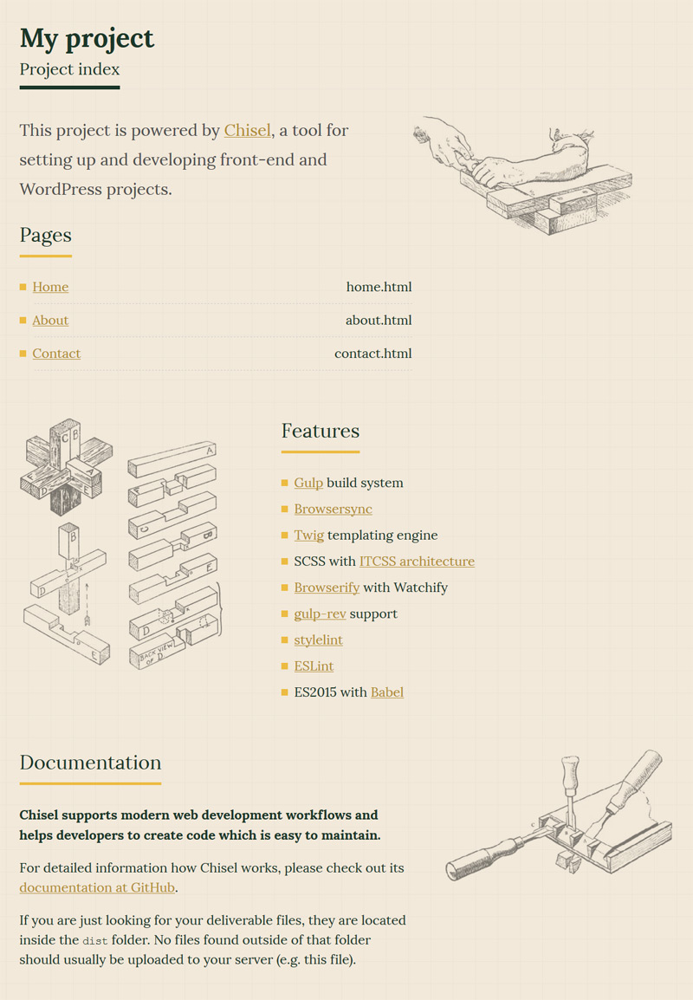

# Chisel [](https://travis-ci.org/xfiveco/generator-chisel) [](https://badge.fury.io/js/generator-chisel) [](https://david-dm.org/xfiveco/generator-chisel)

> Chisel is a [Yeoman](http://yeoman.io) generator for scaffolding front-end and WordPress (coming soon) projects.

[](https://nodei.co/npm/generator-chisel/)



## Features
- [Gulp](http://gulpjs.com/) build system
- [Browsersync](https://www.browsersync.io/)
- [Twig](http://twig.sensiolabs.org/) templating engine
- SCSS with [ITCSS architecture](https://www.xfive.co/blog/itcss-scalable-maintainable-css-architecture/)
- [Browserify](http://browserify.org/) with Watchify
- [gulp-rev](https://github.com/sindresorhus/gulp-rev) support
- [stylelint](http://stylelint.io/)
- [ESLint](http://eslint.org/)
- HTML validation with [htmlhint](https://github.com/bezoerb/gulp-htmlhint)
- optional ES2015 with [Babel](https://babeljs.io/)
- optional jQuery
- optional WordPress setup
  - [Timber](http://upstatement.com/timber/) library installation
  - a base WordPress theme based on Timber with the same workflow as for front-end projects

## Getting started

The following software needs to be installed if you want to develop &amp; build projects created with Chisel. These installations need to be done just once so you can skip this section if you have the software already installed.

### Node.js
Install [Node.js](http://nodejs.org/) so you can work with `npm`, Node package manager. Version 4.5+ is required.

### Yeoman, Gulp &amp; Chisel
Install [Yeoman](http://yeoman.io/), [Gulp](http://gulpjs.com/) and Chisel globally.

```bash
npm install -g yo gulp-cli generator-chisel
```

Congratulations, you are now ready to use Chisel!

## Usage

### Project generation

To create a project with Chisel, create a new folder, open a command line in it and type:

```bash
yo chisel
```

You will be presented with a welcome screen and project scaffolding options. Answer the generator questions according your project needs.

### Project structure

The file structure in generated project looks like this:

- **dist** - distribution files are automatically generated here, this is where you check your work in a browser.
- **gulp** - Gulp tasks configuration
- **node_modules** - Node.js modules for various Gulp tasks, usually you don’t have to do anything about this folder
- **src** - source files, development is done here
  - **assets** - static asset files (images, videos, fonts, etc.) - everything from this directory will be copied to dist folder
  - **styles** - Sass files with [ITCSS](https://www.xfive.co/blog/itcss-scalable-maintainable-css-architecture/) structure
    - `main.scss` - main file where other stylesheets are imported, do not write styles directly to this file
    - **settings** – used with preprocessors and contain font, colors definitions, etc.
    - **tools** – globally used mixins and functions. It’s important not to output any CSS in the first 2 layers.
    - **generic** – reset and/or normalize styles, box-sizing definition, etc. This is the first layer which generates actual CSS.
    - **elements** – styling for bare HTML elements (like H1, A, etc.). These come with default styling from the browser so you can redefine them here.
    - **objects** – class-based selectors which define undecorated design patterns, for example media object known from OOCSS
    - **components** – specific UI components. This is where majority of your work takes place and our UI components are often composed of Objects and Components
    - **trumps** – utilities and helper classes with ability to override anything which goes before in the triangle, eg. hide helper class
  - **scripts**
    - `app.js` - main JavaScript application file where other modules are imported
    - `greeting.js` - a sample JS module, delete or replace this one with your functionality
  - **templates** - Twig templates
    - `base.twig` - base layout which is extended in other templates
    - `template.twig` - a template from which the other pages are generated
    - `*.twig` - separate twig page templates
- **index** - images and styles for the project index
- `index.html` - project index with project pages listed
- `package.json` - npm packages dependencies
- `.yo-rc.json` - Yeoman generator configuration file
- `.editorconfig` - [EditorConfig](http://editorconfig.org/) configuration file to achieve consistent coding style
- `.gitattributes` - [Git](http://git-scm.com/) configuration file to force Unix line ending in text files
- `.gitignore` - default Git ignore files and folders
- `.eslintrc.yml` - [ESLint](http://eslint.org/) configuration file to achieve consistent JavaScript coding style (you can update it to your preference)
- `.stylintrc.yml` - [stylelint](http://stylelint.io/) configuration file to achieve consistent CSS coding style (you can update it to your preference)

On a typical project, you will work in `src` folder and check your work in `dist` folder so you don’t have to touch other files.

### WordPress support
When `WordPress support` is selected during project creation Chisel will download WordPress, Timber and our starter theme. WordPress will be downloaded into `wp` directory, Timber will be downloaded as WP Plugin into `wp/wp-content/plugins/timber-library` and our starter theme into `wp/wp-content/themes` with directory name matching project name.

During instalation Chisel will show you sample Apache VirtualHost configuration for domain `PROJECT-NAME.dev`, you may use other server (like nginx) (TODO: browsersync).

You can always see sample Apache configuration by typing `yo chisel:wp-config` command.

For WordPress projects source directory for CSS, JS and assets is the same as in non-WP project, but twig template files are stored separately, because they are interpreted dynamically by WordPress and Timber, not build by `gulp` like in non-WP projects. They must be stored in `templates` directory inside theme directory.

When project is build assets and compiled CSS and JS files are copied into dist directory inside theme. The starter theme is configured (TODO: it's not) to load them automatically on every page.


### Adding pages to the project
Once you have basic project structure generated, you should add pages you will be working on. Chisel comes with a subgenerator for adding new pages to the project.

From the command line type:

```bash
yo chisel:page "Page Name"
```

for example

```bash
yo chisel:page "Home"
```

You can also create multiple pages at once by separating page names with space:

```bash
yo chisel:page "Home" "About Us" "Contact Us" "News"
```

### Development

When you have the basic setup done, you can start development. To re-compile Twig, SCSS and JavaScript files in real time you can use default task. Type

```
gulp
```

and this will start a task that will watch for changes in files and recompile them as needed. Additionally, development server will be started and BrowserSync scripts injected.

During development `main.css` (unminified) and `bundle.js` are linked in HTML. This is achieved by custom Twig function `assetPath` which updates assets path depending on whether the watch or build tasks are running.

To rebuild the whole project and create new revisions of styles and scripts using `gulp-rev`, use the gulp build task again

```
gulp build
```

When `gulp build` is run, first the `dist` folder is cleaned and then build tasks are run in particular order:

1. `styles-build` builds prefixed and minified styles and creates a stylesheet revision by appending content hash to the filename. Then it creates `rev-manifest.json` with original and revisioned file names
2. `lint` runs EsLint
3. `scripts-build` runs Browserify bundler and creates `bundle.js` revision by appending content hash to the filename. Then it updates existing `rev-manifest.json` with the original and revisioned filename.
4. Finally, `templates-build` reads the newly created `rev-manifest.json` and builds HTML files from Twig templates, while linking revisioned files using the `assetPath` function.

## Credits
A lot of Chisel functionality is copied from or inspired by [Limelight Generator](https://github.com/piotrkulpinski/generator-limelight). Thanks, Piotrek ;)

## License
Chisel is licensed under [MIT License](LICENSE).
